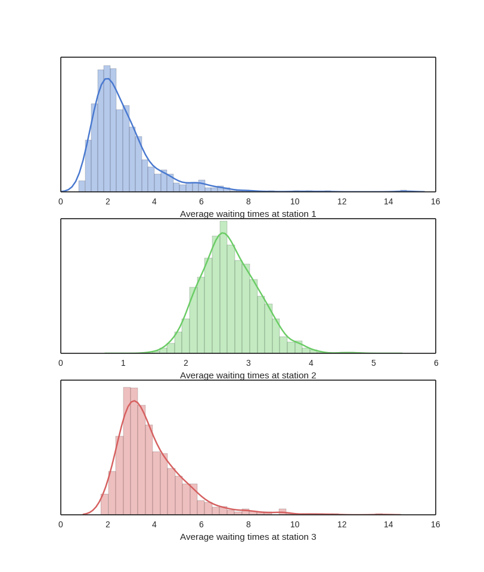
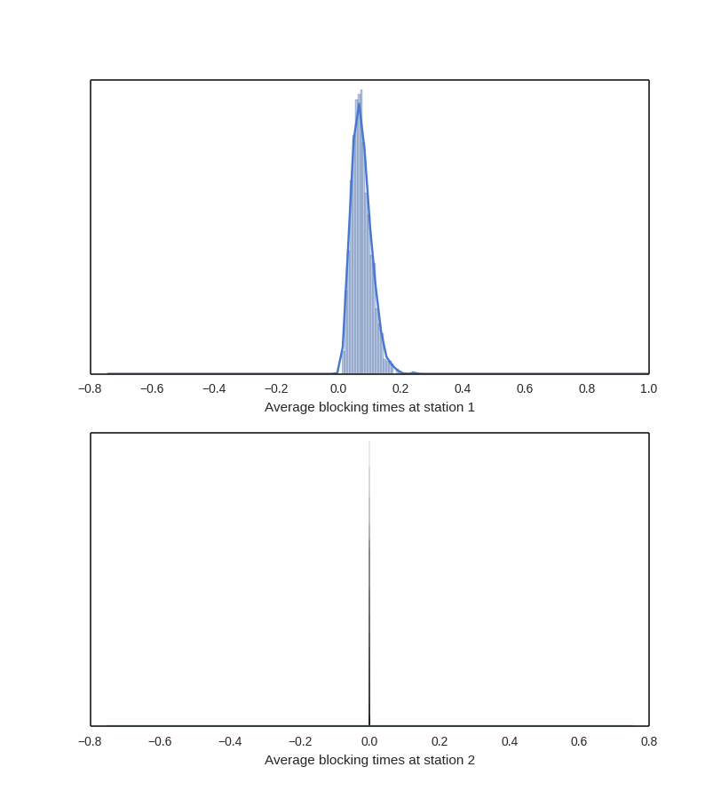

# IFT6561    Homework 1
# Gabriel C-Parent    C5912

## General comments

Most of the code written for the questions that didn't need to be
in java were written in python 3 (since the BigInteger are by default
and that makes the code a lot clearer).

That and python has both the factorial and gamma functions implemented and
you don't actually need a **Java Decompiler** to read the source.

## Exercise 1 a)

*What is the number of ways of choosing the first t cards, for t <= 52,*
*taking order into account?*

**taking order into account (permutations)**
- we want the total number of t-permutations of n
- the state space can be represented by a tree
    - starting with 52 nodes, then 51 for each of the 52...
    - e.g. if t = 3 : (3-permutations of 52) = 52 * 51 * 50
- this is usually denoted as a factorial which stops at n - t 
- 52! / (52 - t)!

**without taking order into account (combinations)**
- we want the total number of t-combinations of n
- the intuition is the same as for the t-permutation
    - there are multiple repetitions in the permutations
- 52! / (((52 - t)!)* (t!))

## Exercise 1 b)

*What is the minimal period length of the generator, and the minimal number*
*of bits needed to represent its state, to make sure that every possibility can*
*happen for the first t cards? Give expressions that are functions of t.*

- The simplest way would be to have 52! / (52 - t)! states.
- These states can be encoded in ceiling(log2(number_of_states)) bits.

- The shortest periodicity of such PRNG would have to be of number_of_states - 1
    - otherwise some state would be impossible to reach (violating the condition)

\newpage

## Exercise 1 c)

*What is that minimal number of bits for t = 52? (Give a numerical value.)*

~~~python

    from math import factorial
    threshold = factorial(52) / factorial(52 - 52)

    necessary_bits = 1
    while 2**necessary_bits < threshold:
      necessary_bits += 1

    print(necessary_bits)  # this yields a value of 226
~~~

This yield a value of 226 bits to represent 52!. If the order is not important,
0 bits would be needed since there would be only one possible state (all of the cards).

## Exercise 1 d)

*If the period length is 2^31 -2 (many widely-used classical LCGs have that value),*
*what is the maximal value of t for which we can have all the possibilities?*

~~~python

    from math import factorial

    def number_of_states(t):
      """calculate the number of states needed for t"""
      assert t>0 and isinstance(t, int)
      return factorial(52) / factorial(52 - t )

    t = 1
    N = (2**31)-2
    while number_of_states(t+1) < N:
      t += 1

    print(t)
~~~

This yields a value of t = 5.

\newpage

## Exercise 2 a)

*Implement the SWB generator of Example 1.16, whose parameters*
*are (b, r, k) = (2^31 , 8, 48), and real-valued output defined by*
*un = x 2n /2 62 + x2n+1 /2 31 , and use it to generate three-dimensional*
*points in [0, 1) 3 , defined by ui = (u25i, u25i+20, u25i+24)*
*for i = 0, ..., m-1, for m = 10^4.*

*Partition the unit cube into k = 10^6 subcubes by partitioning each axis*
*into 100 equal intervals.*

*Number these subcubes from 0 to k - 1 (in any way), find the number of the*
*subcube in which each point u i has fallen, and count the number C of collisions*
*as in Example 1.6. Repeat this 10 times, to obtain 10 “independent” realizations*
*of C, and compare their distribution with the Poisson approximation given in*
*Example 1.6. You can do the latter comparison informally; there is no need to*
*perform a formal statistical test.*

These is the total number of collisions observed in the subcubes, for each
run of the experiment (total of 10 realizations) using MathematicaSWB:

[2170, 2137, 2100, 2104, 2127, 2086, 2111, 2114, 2130, 2158]

The expected value calculated with the Poisson approximation is the following:

~~~python
    def poisson_estimate_collisions(number_of_points, number_of_states):
      """ calculates the estimated number of collisions according to
      ((numberOfPoints^2) / (2 * numberOfCases))"""
      return (number_of_points**2) / (2 * (number_of_states))

    print(estimated_collisions(10000, 10**6))

    
~~~

The estimated number of collisions is 50. We can see that there are way more collisions than expected.
This is a bad sign for the generator, indicating that values do not seem uniform 
(that could be exploited by an attacker).

## Exercise 2 b)

*Redo the same experiment, but this time using a better generator, such*
*as MRG32k3a in SSJ, for example. Discuss your results.*

These is the total number of collisions observed in the subcubes, for each
run of the experiment (total of 10 realizations) using MRG32k3a:

[41, 66, 53, 50, 54, 55, 53, 44, 53, 59]

Since the expected value calculated by Poisson approximation is of 50, this pseudorandom number generator
yields a distribution much closer to expectations, which is a good thing for a pseudorandom number generator...

However, since many other qualitites are needed to evaluate the performance of a pseudorandom number
generator, it cannot be said with just those simple observations that this is a good generator.

\newpage

## Exercise 3 a)

*Voir l’exercice 1.18 des notes. Il n’y a pas de simulation a implanter pour cette question.*
*L’idee est de comprendre ce qui se passe si on estime le volume d’une sphere de rayon 1 en s*
*dimensions par la methode Monte Carlo. Il s’agit bien sur d’un exercice purement academique,*
*puisqu’on connait deja le volume de cette sphere, mais il permet de comprendre un type de*
*difficulte qui survient dans de nombreuses applications pratiques. Pour estimer le volume, on*
*tire n points au hasard dans le cube (0, 1) s , on calcule la fraction pn de ces points qui tombent*
*dans la sphere (pour estimer la fraction p du cube occupe par la sphere), et l’estimateur du*
*volume est un = 2 s pn.*
*(a) Prouvez que cet estimateur est sans biais. Donnez aussi (avec preuve) des formules exactes*
*pour la variance et l’erreur relative de cet estimateur, en fonction de s.*

See next pages.

## Exercise 3 b)

*Pour avoir une erreur relative constante en fonction de s, disons inferieure a  0.01 pour*
*tout s, a  quelle vitesse (ou de quelle maniere) doit-on augmenter n en fonction de s, lorsque*
*s est grand? Donnez une formule pour n en fonction de s et expliquez ce que cela implique*
*pour les grandes valeurs de s.*

See next pages.

## Exercise 3 c)

*Calculez les valeurs numeriques de p, V s , et de l’erreur relative au carre de u*
*n , RE 2 [ ̃u n ], pour s = 2, 5, 10, 20.*

~~~python
    from math import gamma, pi

    def Vs(s):
      """calculates the volume of the s-dim unit cube"""
      return (pi**(s/2))/gamma(1+(s/2))

    def p(s):
       """returns value of p in s-dimensions"""
       return(Vs(s)/(2**s))

    def REn(s):
      return(((2**s)-Vs(s))/(Vs(s)))

    for s in [2, 5, 10, 20]:
      print("s = {0}\t\t p = {1}\t\t\tVs={2}\t\tRE^2={3}".format(s, p(s), Vs(s), REn(s)))
~~~

\newpage

## Exercise 4 a)

*Repetez cette simulation n = 1000 fois, puis calculez la valeur estimee et un*
*intervalle de confiance a 95% pour l’esperance de chacune des 5 quantites*
*calcules (temps total d’attente et temps de blocage a chaque station).*

~~~
    REPORT on Tally stat. collector ==> Average waiting times for station 1
        num. obs.      min          max        average     standard dev.
          1000        0.773       14.758        2.715        1.446

    REPORT on Tally stat. collector ==> Average blocking times for station 1
        num. obs.      min          max        average     standard dev.
          1000        0.011        0.244        0.074        0.032

    REPORT on Tally stat. collector ==> Average waiting times for station 2
        num. obs.      min          max        average     standard dev.
          1000        1.462        4.706        2.706        0.462

    REPORT on Tally stat. collector ==> Average blocking times for station 2
        num. obs.      min          max        average     standard dev.
          1000     -2.2E-15      2.4E-15     -1.1E-17      7.8E-16

    REPORT on Tally stat. collector ==> Average waiting times for station 3
        num. obs.      min          max        average     standard dev.
          1000        1.718       13.739        3.881        1.458
~~~

\newpage

## Exercise 4 b)

*Faites aussi tracer des histogrammes des 1000 valeurs observes pour chacune de ces 5 quantites.*

The histograms were made using *Seaborn* library in python3.
The script is available with the rest of the code.
The number of bins was decided using the Freedman–Diaconis formula.

\newpage

### Waiting time histograms

\newpage

### Blocking time histograms

\newpage

## Exercise 4 c)

Discutez ce que vous observez; par exemple ou observe-t-on davantage d’attente ou de blocage?

Les paramètres de simulations étaient les suivants:

c1 = Inf, c2 = 4,   c3 = 8

u1 = 1.5, u2 = 1.2, c3 = 1.2

**Temps d'attente**

- on constate probablement un manque d'échauffement pour la simulation
    - le système semble être sensible aux conditions initiales
- stations 1 et 3 varient beaucoup (échauffement probablement)
- station 2 semble avoir une belle distribution normale

**Temps de blocage**

- on semble avoir une loi normale pour la première station
- la deuxième ne semble pas subir de blocage
    - c'est peut-être causé par une erreur de programmation...
    - ou parce que la 3e a 2 fois plus de queue que la 2e et la même vitesse de service

