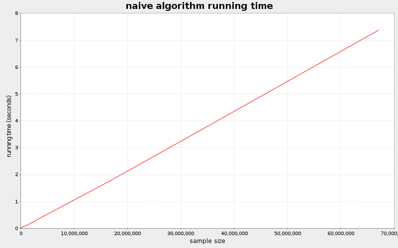
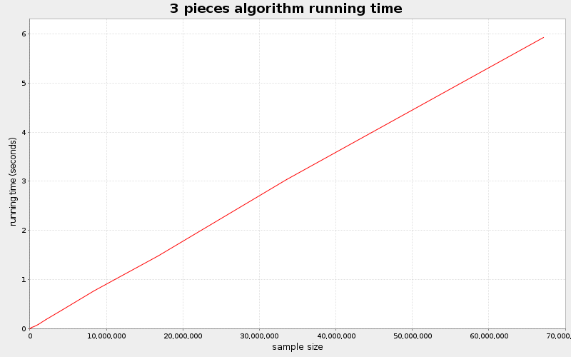
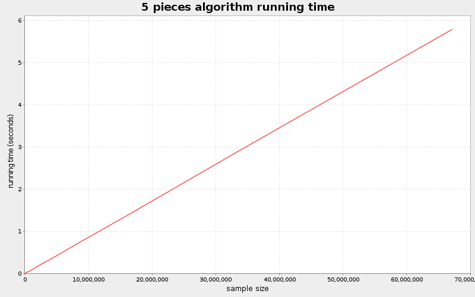
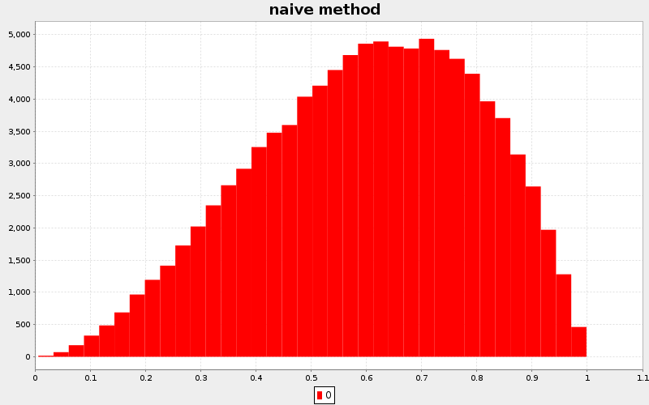
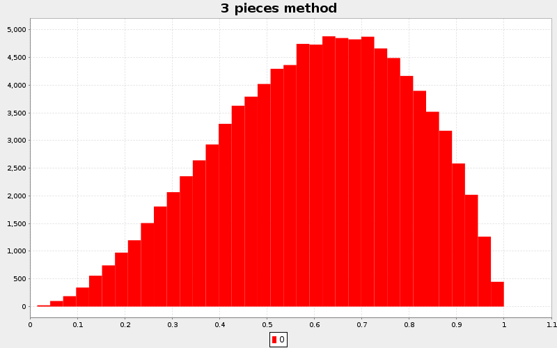

## Exercise 2

### a)

*In Example 4.2, explain in detail how to generate from the
sampling density $g$ that corresponds to the hat function
$h$ of Figure 4.2, by inversion.*

### The rejection method

The goal is to generate $(x,y)$ uniformly in $S(f)$.

### The idea

The trick to achieve that is to generate $(x,y)$ in a space that
encloses S(f) and check if $(X, Y) \in S(f)$. If it does belong,
then we return it as a random point of the density $S(f)$,
otherwise we try again.

### The problem

So if the enclosing space is huge in relation to the volume
of $S(f)$, it would be expected that very few points actually
land in $S(f)$ and therefore most of the randomly generate
points are lost.

Therefore, depending on the shape of the enclosing space and $S(f)$,
this procedure can become extremely wasteful or work pretty well.

### The hat function trick (majoring function)

The idea is to fit the enclosing space as closely as possible
to $S(f)$ to avoid generating points for nothing.

In this exercise, the hat function is a piecewise constant
uniform distribution in $(0, 1)$. This hat function $h$ has
breakpoints optimized to diminish the area over the curve.

The inversion works simply by generating $(x,y) \in U(0,1)^2$.
We scale y to the hat function height (in the particular piece)
and check if the point is in $S(f)$. If it is, we accept and
return x, otherwise we generate the next point.

The expected number of points that will be wasted is the ratio of the area over 
the curve $S(f)$ to the total area.
By selecting the breakpoints optimally, this ratio can be minimized.

### b)

The implementation is in *exercise2.java*.
In the runtime results, you can see that the
runtime of the 3 pieces algorithm is slightly less
than the one of the naive algorithm. Very close to
$\frac {1.38997} {\frac {16}{9}}$, the expected ratio.

### c)

The 4 breakpoints were optimized by supposing that there were two distinct
areas on each side of $x = \frac {2} {3}$.

The optimization for the breakpoints was:

$max \{ x_1 * (\frac {16}{9} - f(x_1)) + (x_2 - x_1)*(\frac {16}{9} - f(x_2)) \}$

$max \{ (1 - x_4) * (\frac {16}{9} - f(x_4)) + (x_4 - x_3) * (\frac {16}{9} - f(x_3))\}$

this yields the values (by wolfram alpha):

$$x_1 = 0.202604$$
$$x_2 = 0.381073$$
$$x_3 = 0.847968$$
$$x_4 = 0.932157$$

These new breakpoints yield a total area of

$Area = x_1f(x_1) + (x_2 - x_1)f(x_2) + (x_3 - x_2)\frac {16}{9} + (x_4 - x_3)f(x_3) + (1 - x_4)f(x_4)$
$Area = 1.26053$

This is slightly better than the 3 pieces version, which
has a total area of 1.38997.

\newpage

**Runtime results**

Points in the range of $2^0$ to $2^{27}$ were generated by using
the three different algorithms.

\newpage

**Correctness results**

100000 points were generated by each algorithm and the empirical
distribution is graphed here. This confirms that the algorithm works fine.

