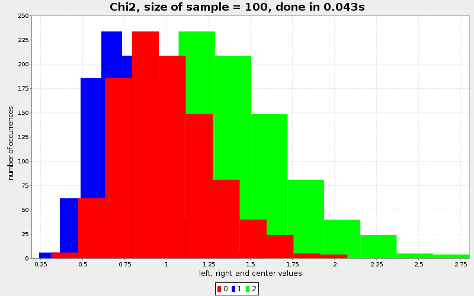
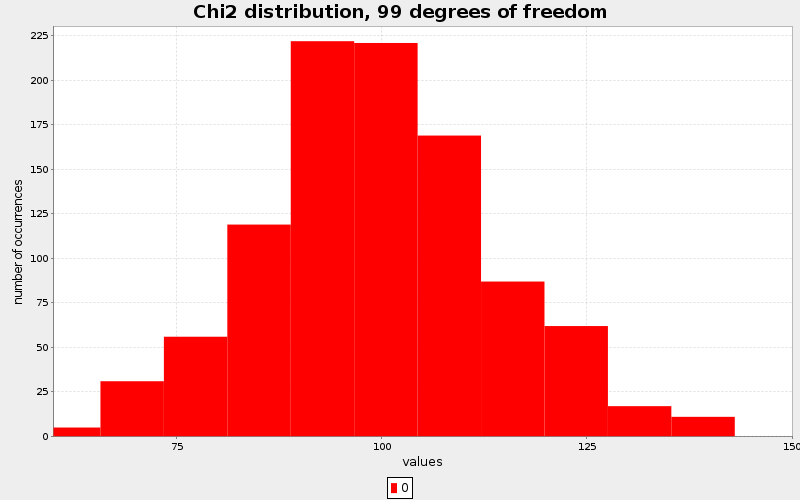
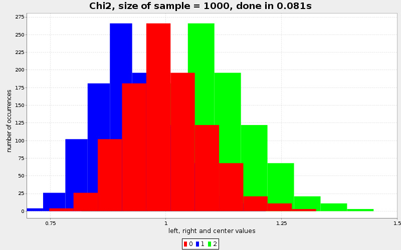
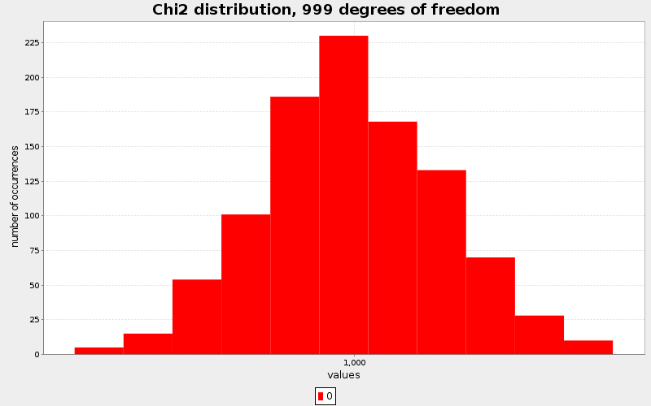
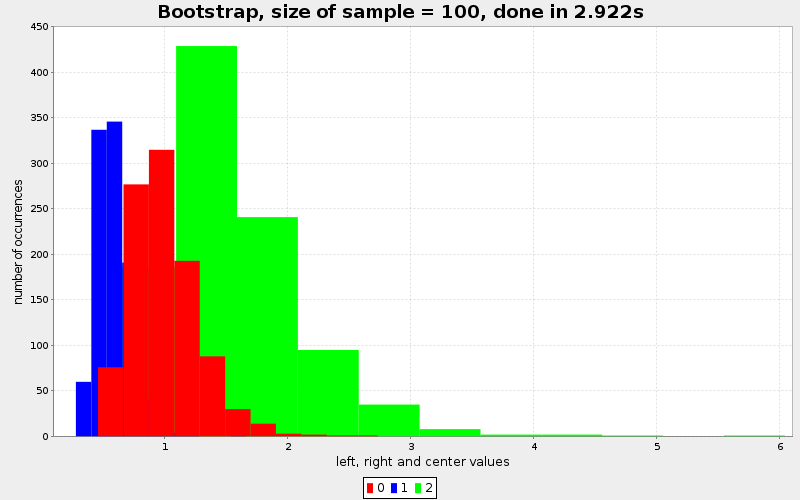
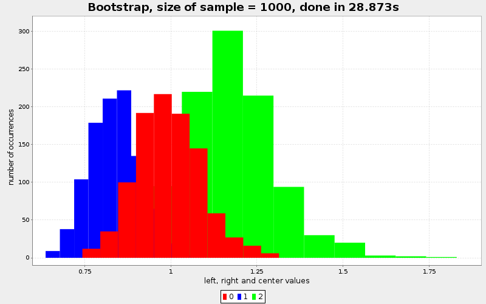

## Exercise 3

### a) and b)

Confidence intervals for the variance of 100 samples (chi-square).

**Empirical values obtained**

$\mathbb{E}[w]\ =\ 0.5762 \pm\ 0.0098$

$\hat{p} = 0.687 \pm 0.028$

The left sides, centers and right sides of the confidence intervals calculated are plotted
in the same fashion for every figure.

*note: the confidence interval for $\hat{p}$ is calculated using the student confidence interval*

\newpage

Confidence interval for the variance of 1000 samples

**Empirical values obtained**

$\mathbb{E}[w]\ =\ 0.176186 \pm\ 0.00094$

$\hat{p} = 0.697 \pm 0.028$

\newpage

**Comparison between 100 and 1000 samples**

When using more data, the confidence interval on the variance estimated using the chi-squared
distribution is narrower. Although the interval is narrower, the coverage percentage stays
basically the same (about 69%).

Basically, you get a better precision, but the values tend to the same and the coverage isn't great.

The 

Let's see what happens when the bootstrap procedure is used to get the confidence interval.

\newpage

### c)

The same procedure as in a) and b) was done, but this time the variance confidence
interval is estimated using the basic nonparametric bootstrap procedure.

Confidence interval for the variance of 100 samples

Empirical values obtained

<!---
[0.960594541434953, 0.02987332806812124,
 0.8679999999999998, 0.02101544855141382,
 1.0587420736261255]
-->

$\mathbb{E}[w]\ =\ 0.960 \pm\ 0.029$

$\hat{p} = 0.867 \pm 0.021$

\newpage

Confidence interval for the variance of 1000 samples

Empirical values obtained

<!---
[0.3397482379278616, 0.004555646454367476,
 0.9049999999999999, 0.01820446532652735,
 1.0056010110587519]
-->

$\mathbb{E}[w]\ =\ 0.3397 \pm\ 0.0045$

$\hat{p} = 0.904 \pm 0.018$

\newpage

When using 100 as sample size, the interval boundaries
is pretty unstable as can be seen on the figure.
and it's width is very big ($0.960 \pm 0.029$) 
but contains the true value much more often than both of the previous chi-squared versions.

When using 1000 as sample size, the interval boundaries get much smaller ($0.3397 \pm 0.0045$)
and the coverage gets even better ($0.904 \pm 0.018$).

This improvement in performance comes at a price however, the performance.
In the chi-squared estimations, the time necessary to compute the values was 0.043 and 0.081s
whereas the necessary time for the bootstrap procedure was 2.922 and 28.873s.

To evaluate the performance of an estimator, there are multiple factors such as the variance,
the bias and the cost. In this case, the chi-squared estimator is biased and the nonparametric
bootstrap isn't. However the cost of the chi-squared estimator is much smaller than the one of the
bootstrap.

Therefore, each estimator has its advantage, depending on what is important.

