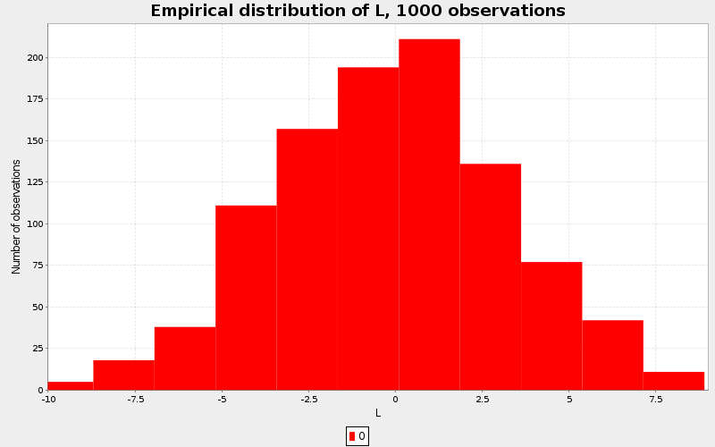
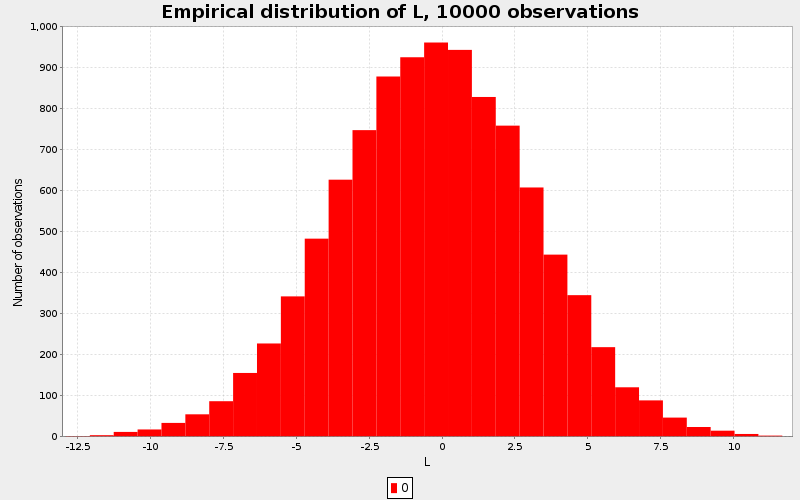

## Exercise 4

For the binomial 95% interval, I used the Agresti-Coull CI, seeing as it was
the simplest one to implement (*Agresti, Alan; Coull, Brent A. (1998). "Approximate is better 
than 'exact' for interval estimation of binomial proportions". The American Statistician 52: 119–126*).

### a)

Value at Risk, p = 0.01 : -8.19540513589044

Normal 95% CI : [-8.783811550699738, -7.736212733988907, 4, 17]

Binomial 95% CI : [-8.664001203799785, -7.416992392966904, 5, 19]

The indices are given for the CI, just to get an idea of the position in the array.
In this case, we have 1000 samples, and we can see that there isn't that much data available on the
left side (only 4 or 5 data points for both approximations).

### b)

Value at Risk, p = 0.01: -8.27507496794476

Normal 95% CI : [-8.526275232805233, -7.967243953356331, 81, 120]

Binomial 95% CI : [-8.483248356935405, -7.9209375312843235, 82, 122]

Same as in a), there aren't that many points on the left side, but both CIs are pretty
much in agreement.

### c)

For 1000 observations:

Value at Risk, p = 0.001: -9.540483691483473

Normal 95% CI : [-10.460665152681031, -9.232617526759554, 0, 3]

Binomial 95% CI : [-10.460665152681031, -8.52938185010214, 0, 6]

For 10000 observations:

Value at Risk, p = 0.001 : -10.728640018803503

Normal 95% CI : [-11.258303688144565, -10.360134297367836, 4, 17]

Binomial 95% CI : [-11.153490053393853, -10.184196627333392, 5, 19]

In the case of a smaller CI, the observation looks more like a rare-event and
the normal approximation should really not be used.

Importance sampling should really be used in this case. In the case of 1000 samples especially, the binomial interval
is twice as big as the normal's, which makes sense with so little data on the left tail.

Here are the figures of the empirical distributions.

\newpage

